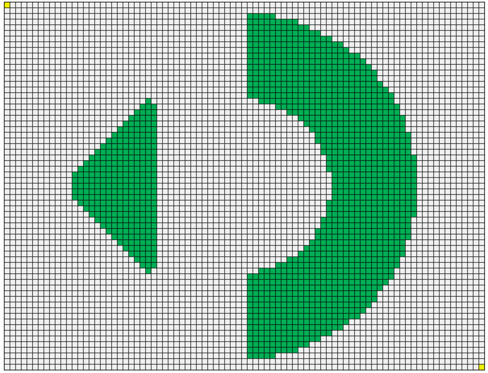
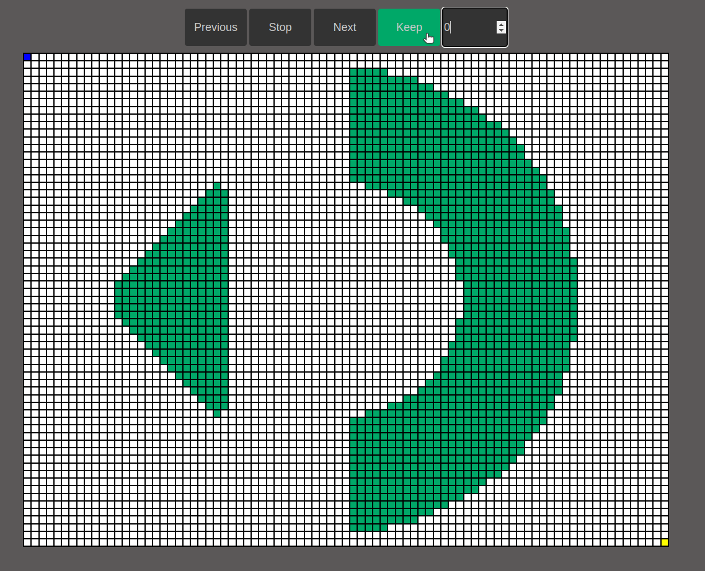

# Desafio do Labirinto Autômato Stone

### Este projeto utiliza as seguintes tecnologias:
- JavaScript
- HTML
- CSS

### Introdução
Neste desafio, o objetivo será transitar por labirintos de autômatas celulares. Autômata celular é uma coleção de células em uma matriz que evoluem com o passar do tempo, de acordo com um conjunto de regras definidas pelo estado das células vizinhas. Trata-se, portanto, de uma ferramenta computacional poderosa, capaz de representar de forma muito eficiente o funcionamento dos sistemas evolutivos.Ela pode ser usada para simular aplicações na biologia evolutiva, na dinâmica de reações químicas, na criptografia, no comportamento dos mercados, nos sistemas dinâmicos da física, na antropologia, nas ciências políticas, dentre outras aplicações.

### Desafio
Transitar por um autômato cuja matriz possui 65 linhas e 85 colunas, conforme mostra a figura abaixo.



### Objetivo
O objetivo desta fase é resolver o labirinto de autômatas celulares utilizando algoritmos e códigos de programação, considerando o modelo de propagação estabelecido. As células brancas e verdes têm comportamentos específicos, sendo que as brancas se transformam em verdes ou permanecem brancas de acordo com o número de células verdes adjacentes, e as verdes permanecem verdes ou se transformam em brancas de acordo com o mesmo critério. É preciso considerar a definição de células adjacentes para aplicar corretamente as regras do modelo de propagação. O objetivo final é submeter um arquivo de texto com a sequência de movimentos da partícula, saindo do ponto inicial até atingir o ponto de destino, sem nunca finalizar em uma célula verde.

### Regras
- As células brancas transformam-se em verdes, se possuírem número de células adjacentes verdes maior do que 1 e menor do que 5. Do contrário, permanecem brancas.
- As células verdes permanecem verdes se possuírem número de células adjacentes verdes maior do que 3 e menor do que 6. Do contrário, transformam-se em brancas.
- Duas células são consideradas adjacentes se possuem uma fronteira, seja na lateral, acima, abaixo ou diagonalmente
- A configuração inicial da matriz, ou seja, a cor de cada célula no início está representada neste [arquivo](src/content/matriz.txt).

### Movimentos até o destino
Deve ser gerado os movimentos da partícula, saindo do ponto inicial até atingir o ponto de destino.
Cada movimento deve ser separado por um espaço em branco. Cada letra representa um passo da partícula e, consequentemente, uma atualização do tabuleiro.

- U - movimento para cima
- D - movimento para baixo
- R - movimento para direita
- L - movimento para esquerda

### Projeto em funcionamento


### Resultado
Após o cálculo da matriz, o programa exibe no console o número de passos necessário para alcançar o destino, qual movimento foi realizado em cada passo e o tempo de execução.

### Reutilização de código
O código foi desenvolvido para solucionar labirintos de autômatos celulares de diferentes tamanhos e configurações. Ele pode lidar com matrizes de dimensões variadas, desde 5x5 até 100x100, e também é capaz de lidar com múltiplas saídas e chegadas, como exemplificado na matriz abaixo:
```sh
[[3, 0, 0],
 [1, 0, 1],
 [0, 0, 4]]
```
Com isso, é possível utilizar o código para resolver uma ampla gama de problemas em que os autômatos celulares são aplicáveis.